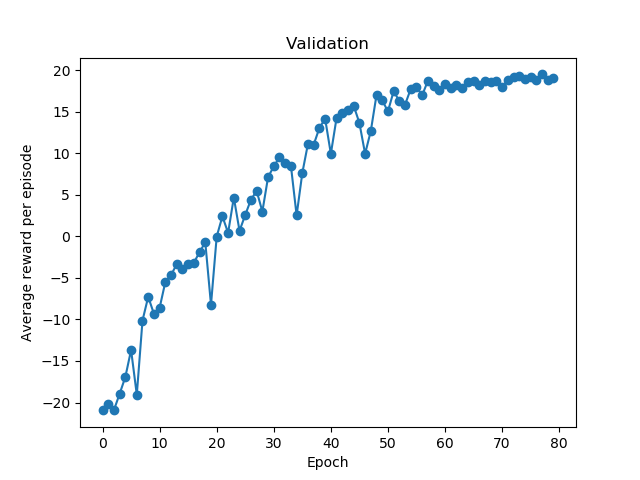
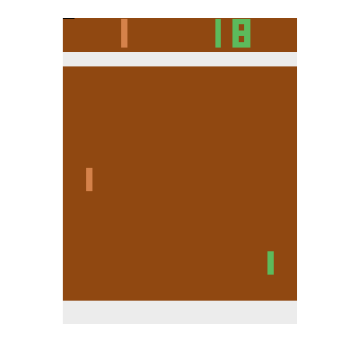

# DQN Pong
A PyTorch implementation of Deep Q-network (DQN) based on [Human-level control through deep reinforcement learning](https://storage.googleapis.com/deepmind-media/dqn/DQNNaturePaper.pdf) for Pong.

## Examples
Training DQN using Adam optimizer with learning rate of 10<sup>-5</sup> for 20 million frames gives the result shown in the left figure below. The hyperparameters are the same as in the paper, except for the optimizer. An epoch consists of 250 k training and 125 k validation frames. The best agent chosen based on the validation performance achieved the mean of 19.0±1.5 of standard deviation in evaluation (the original result of the paper is 18.9±1.3). In the right figure below, this agent is shown winning in a random episode of the evaluation.

  

## Usage

### Evaluation
The default mode is 'eval'. One option in this mode is to save some number of last frames from a random evaluation episode into a gif by using ```--save_gif```. Saving a gif option is not included as a default, because it requires relatively high amount of RAM, around 5 GB with the default setting of 1 k frames. However, if the option is used, the number of last frames to save into a gif can be changed with ```--n_frames_gif```.

```python3 DQN_Pong.py```

### Training
Because in the current implementation replay memory is not optimized and is set to 1 M as a default, it requires a lot of memory, about 53 GB. The size of replay memory can be controlled with ```--replaymemory_capacity_full```, but worse results should be expected if replay memory size is decreased.

```python3 DQN_Pong.py --mode train```

### Training and evaluation
'traineval' mode will first train an agent and then evaluate the agent. Check some of the specifics of each mode above.

```python3 DQN_Pong.py --mode traineval```

## Acknowledgement
This implementation builds on [PyTorch Reinforcement Learning (DQN) Tutorial authored by Adam Paszke](https://pytorch.org/tutorials/intermediate/reinforcement_q_learning.html).
